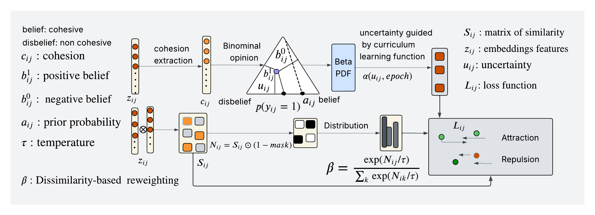

# 🧭 Overview

**ViCo-LWIR** is a *plug-and-play contrastive learning framework* designed for spatially structured modalities(**thermal**) data, etc.
It robustly handles *intra-* and *inter-class variability*, enabling consistent embeddings across challenging datasets.

🧪 As a demonstration of its capabilities, **ViCo-LWIR** has been applied in *Detection of Spills in Indoor environments using weakly supervised contrastive learning* — showcasing its practical impact in real-world spill detection scenarios.

⚙️ While the framework is **modality-agnostic** and can be extended to other dense spatial tasks, extending **VicoClr** to sparse, graph-structured data such as **skeletons** represents an exciting direction for future work.

## Framework Architecture
  <p align="center">
  
</p>

**figure 1:** *Through the encoder, feature embeddings are extracted to obtain zij , which are subsequently normalized*. *From these embeddings, the cohesion*
*score cij is computed, representing how likely samples xi and xj remain compact within the same* *co-cluster. A binomial opinion is modeled as a Beta*
*probability density function (PDF), under the assumption of a bijective mapping between both representations. The uncertainty uij is then computed to*
*measure the confidence that xi and xj can be close within a cluster, enabling the model to avoid forcing samples of the same class together despite strong*
*visual differences. To ensure stable and gradual learning, a curriculum function  is introduced to guide progressive training and to*
*compute the adaptive weight wij , addressing intra-class variability. For inter-class modeling, the parameter β is computed as described in the schema above*,
*allowing the model to focus on hard negatives and enhance class separation. All these components are integrated into the final loss function Lij .*

## 🎯 Why ViCo-LWIR?
ViCo-LWIR (ViCo-LWIR: Vision-Based detection of Indoor Liquid Spills Using
Long-Wave Infrared Imaging and a Weakly Supervised Contrastive) addresses one of the most persistent challenges in computer vision: uncertainty under weak supervision. Traditional vision systems are typically designed and optimized for perception tasks involving rigid, well-structured objects with distinct geometric cues. However, these systems often fail when faced with visually ambiguous targets such as indoor liquid spills, whose irregular shapes, diffuse boundaries, and variable textures defy conventional object representations.

- ✨ *The difficulty arises from several intertwined factors:*
- ✨ *The absence of clear contours or well-defined shapes;*
- ✨ *Extreme intra-class variability in appearance and scale;*
- ✨ *Weak or inconsistent edge and texture cues;*
- ✨ *Frequent occlusion and foreground–background blending;*
- ✨ *A scarcity of reliable labeled examples; and*
- ✨ *environmental disturbances such as illumination changes, surface reflections, and sensor noise*.

## Key Features
- ✅ Handles **ambiguous and irregular objects** that standard vision models struggle with
- ✅ Supports: **RGB, thermal, depth, etc.**
- ✅ **Memory-optimized** contrastive learning for faster training
- ✅ Produces **highly discriminative embeddings** for downstream tasks
- ✅ Handles **class imbalance**
- ✅ Easy integration into existing PyTorch pipelines
  
### Environment Setup
```bash
**Create virtual environment**
***python -m venv venv***
**Activate the virtual environment**
**On Linux/macOS**
***source venv/bin/activate***
```
